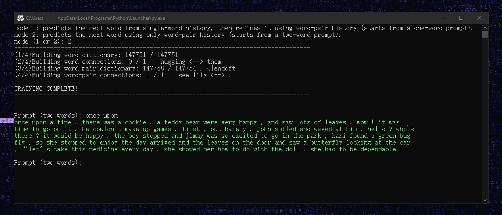
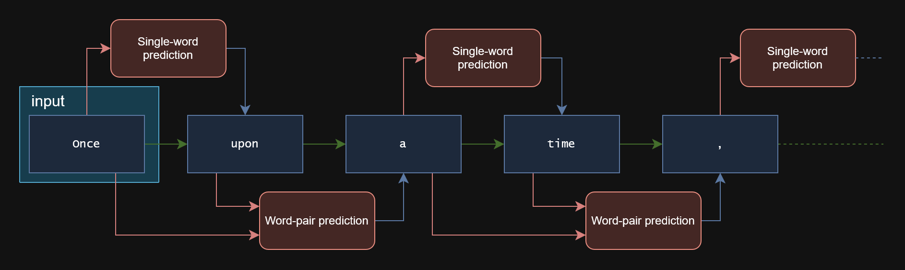
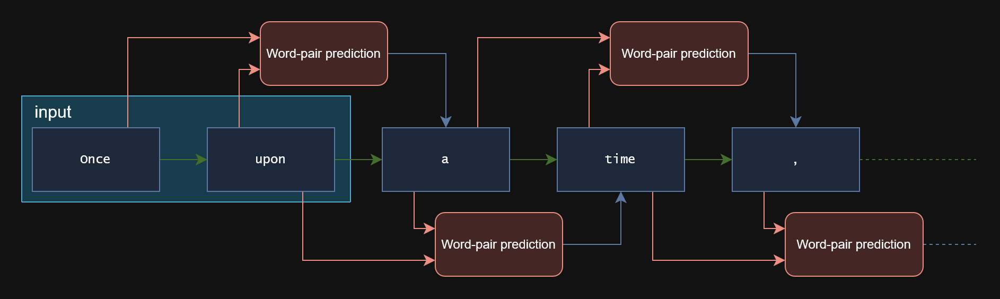

# Text-Synthesizer-With-Markov-Chain
A small experimental Python script that generates text using the Markov chain principle. I made this mainly to get comfortable working with Python dictionaries — nested dictionaries, counting/updating keys, and building lookup tables from scratch — rather than to build a "real" text generator.

## How it works

1. **Preprocessing** — `input.txt` is read in, punctuation gets padded with spaces so it tokenizes cleanly, and the whole text is lowercased and split into a word list.
2. **Building the tables** — two prediction tables are built from that word list:
   - A **single-word table**: for every word, what word tends to follow it, and how often.
   - A **word-pair table**: for every pair of consecutive words, what word tends to follow *that* pair, and how often.
   
   Both tables are then reorganized by frequency (`ordered_p_table` / `ordered_pair_p_table`) so that, at generation time, more common follow-up words are more likely to be picked — this is what gives the output its Markov-chain randomness instead of always picking the single most likely word.
3. **Generation** — depending on the mode, the script walks forward one word at a time, using the tables above to pick the next word, and prints the result with a little typewriter/color effect.



## Modes

- **Mode 1 — single word + pair (alternating)** 
- Alternates between Single-word prediction and Word-pair prediction.



  
- **Mode 2 — pairs only** 
- Word-pair prediction only.



## Usage

`input.txt` (the training data) is already included in this repository, so just clone the repository and run the script:
 
```bash
git clone https://github.com/satoo-ino/Text-Synthesizer-With-Markov-Chain.git
cd Text-Synthesizer-With-Markov-Chain
python "Text Synthesizer With Markov Chain.py"
```
 
1. Choose a mode (`1` or `2`) when prompted.
2. Type a starting prompt — one word for mode 1, two words for mode 2.
3. If you type a word/pair that never appeared in the training data, the script will tell you and print a few random example prompts pulled from the actual data, then let you try again.
Press `Ctrl+C` to exit — the prompt loop runs indefinitely by design.


## Requirements

- Python 3, standard python library only (`os`, `random`, `time`).
- A terminal that supports ANSI colors for the typewriter effect (most Linux/macOS terminals, and Windows 10+ terminals).

## Notes

This is a learning/experimental project, not a polished tool:
- No smoothing or fallback for unseen words/pairs beyond the error message.
- Tables are rebuilt from scratch every run — nothing is cached or saved.
- Not optimized for large training files; very frequent words/pairs can make the weighted-selection lists fairly large in memory.
